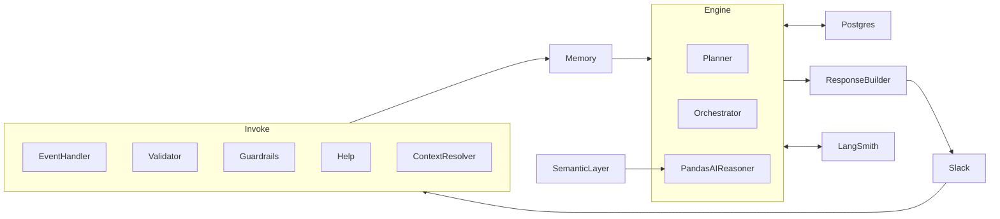

# Project Context

## Project Overview

This project is a conversational agent that lets users query the **Chinook** music store database using natural language from **Slack**. The agent makes data exploration accessible without writing SQL or leaving Slack. Results are returned as conversational text, markdown tables, or charts (when the user explicitly asks for a chart/graph/plot).

## System Scope

**In scope**

- Natural-language questions about the music store (Chinook): artists, albums, tracks, revenue, playlists, invoices, etc.
- Request validation and guardrails (music-store domain, PII, read-only, prompt-injection protection).
- SQL generation and execution against the Chinook Postgres database via PandasAI.
- Slack as the sole user-facing channel (Socket Mode).
- Conversational formatting of results: tables for data; charts when requested.
- Memory for conversational context and follow-up resolution (e.g. “top 3” after “revenue per artist”).
- Optional integration with LangSmith for observability.

**Out of scope**

- Other channels (web UI, public API).
- Write operations or non–read-only database access.
- Domains or data outside the music store.
- Arbitrary or non-validated SQL execution.

## Project Structure (code)

| Path | Role |
|------|------|
| `slackbot_agent/main.py` | Entry point. Slack Bolt app, message handler, wiring of intake → engine → output → memory. |
| `slackbot_agent/intake/` | **Invoke**: request handling, validation, guardrails, help/greeting, context resolution. |
| `slackbot_agent/memory/` | Per-channel conversation store; provides context to the engine and context resolver. |
| `slackbot_agent/engine/` | **Engine**: planner (chat vs follow_up), orchestrator, PandasAI reasoner. |
| `slackbot_agent/semantic_layer/` | Loads Chinook table/view definitions from YAML; builds PandasAI sources via `pai.create` / `pai.load`. |
| `slackbot_agent/output/` | **Output**: response builder formats engine output (tables, errors), normalizes chart paths (exports dir → base64), uploads images or sends text to Slack. |
| `datasets/chinook/` | Semantic layer YAMLs: one folder per table or view (e.g. `album/`, `artist/`, `music-analytics/`), each with `schema.yaml`. |
| `tests/` | Pytest tests (e.g. memory, validator, context resolver). |

## Architecture Summary

The system is organized into three subsystems: **Invoke**, **Engine**, and **Output**. **Memory** and the **Semantic Layer** support them.

- **Invoke** receives Slack messages. The message handler in `main.py` extracts text and channel. **Validator** ensures the request is in the music-store domain. **Guardrails** enforce PII checks and read-only / prompt-injection safety. **Help** and **greeting** handlers return fixed responses. **Context resolver** (LLM) expands short follow-ups using the last exchange when the message lacks music keywords.
- **Memory** stores recent turns per channel and supplies context to the context resolver and to the engine for follow-up execution.
- **Engine** processes the validated query. The **Planner** decides first turn vs follow-up. The **Orchestrator** calls the **PandasAI Reasoner** (chat or follow_up). The **Semantic Layer** loads schema YAMLs from `datasets/chinook/` and provides dataset sources to the Agent; the reasoner generates SQL and runs it against Chinook (read-only).
- **Output** is handled by the **Response Builder**: it formats text (tables, errors), normalizes chart responses (reads chart files from `exports/charts` and converts to base64 when the engine returns a path), uploads images to Slack or sends formatted text. Chart images are written by PandasAI to `slackbot_agent/exports/charts/` when the user asks for a chart.
- **External**: Postgres (Chinook), Slack, OpenAI (PandasAI/LiteLLM and context resolver), optional LangSmith.

## Key Inputs and Outputs

- **Inputs:** User message from Slack; optionally, prior conversation context from Memory.
- **Outputs:** A Slack message: formatted text (with markdown tables when the response is tabular), an uploaded chart image when the user asked for a chart and the engine returned one, or a clear error/clarification message.

## Design Rationale

- **Conversational format:** Response Builder and Memory keep answers readable and support follow-ups (e.g. “top 3”, “chart for that”).
- **Safety and scope:** Validator and Guardrails keep requests in-domain, read-only, and safe (no PII, no prompt injection or out-of-scope actions).
- **Slack-only:** Single channel keeps scope clear: ask in Slack, get an answer (text or chart).
- **Semantic layer:** YAML schemas in `datasets/chinook/` define tables and the `music-analytics` view; the reasoner uses these to produce correct, constrained SQL.
- **Planner and Orchestrator:** Planner chooses chat vs follow_up; Orchestrator runs the reasoner so the engine stays simple to extend.
- **Charts:** Charts are generated by PandasAI and saved under `exports/charts/`. The Response Builder reads those files when the engine returns a path, converts to base64, and uploads to Slack so the engine does not need to handle file paths in its API.
